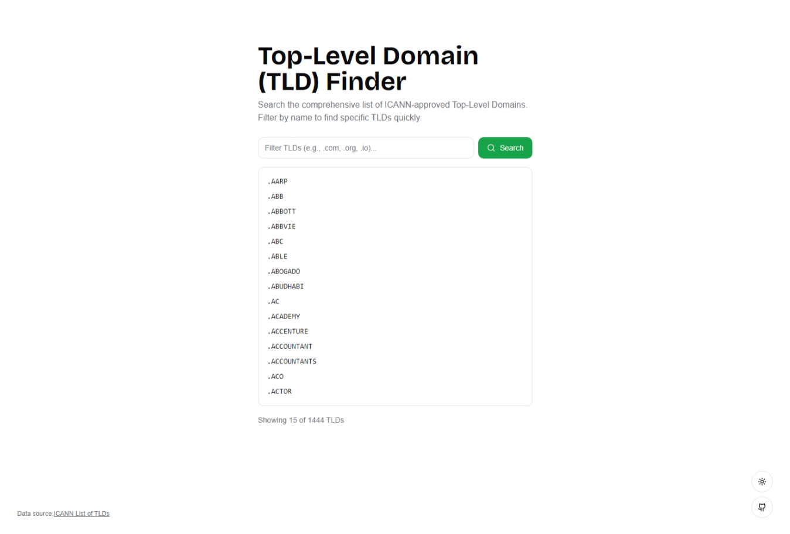

## TLD Finder

Search the comprehensive list of ICANN-approved Top-Level Domains. Filter by name to find specific TLDs quickly.

### Screenshot

Checkout the [live demo](https://tld-finder.vercel.app/).

### Technology Stack

-   Next.js
-   Tailwind CSS
-   Shadcn UI

### Data Source

The data source is the [ICANN List of TLDs](https://data.iana.org/TLD/tlds-alpha-by-domain.txt).
